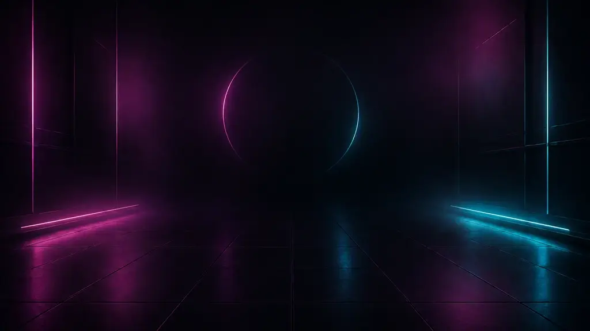
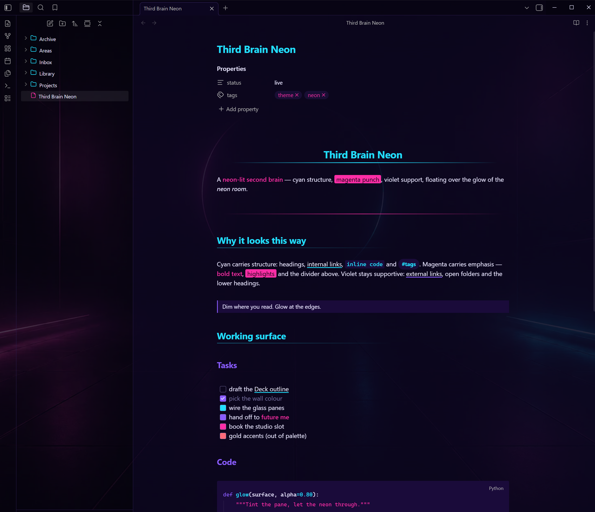
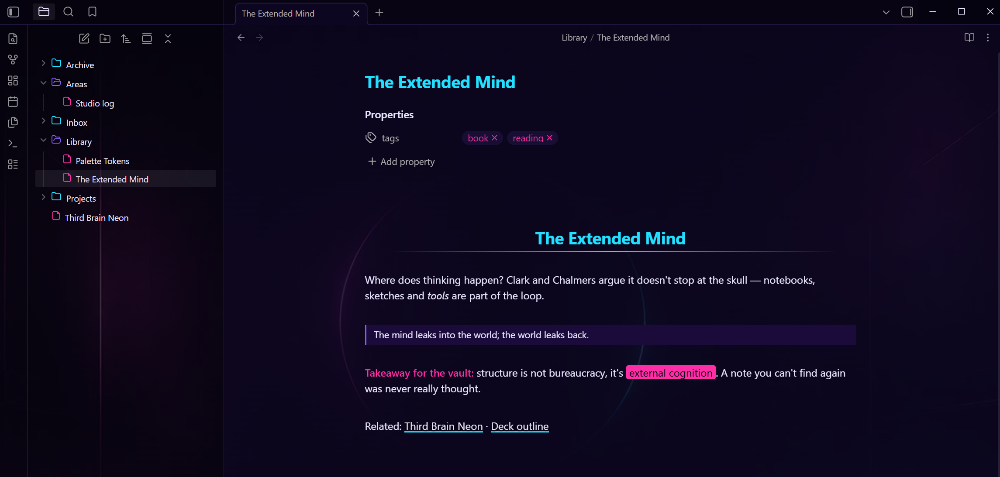

# Third Brain Neon

A dark, neon cyan/magenta theme for [Obsidian](https://obsidian.md) — glass panes floating over an embedded neon room.

## Screenshots

## Features

- **Neon palette with clear roles** — cyan `#22E0FF` carries structure (H1/H2 with gradient underlines, internal links, inline code, tags), magenta `#FF2EA6` carries emphasis (bold, highlights, horizontal-rule gradients), violet `#8A5CFF` supports (H3–H6, external links, interactive accents). Body text is a soft lavender on deep violet-black grounds.
- **The neon room** — an original AI-generated wallpaper is embedded directly in the theme (a single 50 KB WebP data URI; no external assets, works fully offline). Workspace surfaces are tinted glass: dimmest where you read, more transparent at the sidebars so the neon glows through the file tree.
- **State-coloured explorer icons** — Lucide glyphs baked into the CSS: magenta files, cyan closed folders, violet open folders, so expanded branches read at a glance.
- **Click-accurate editor spacing** — heading and divider spacing in the editor is padding-only. CodeMirror 6 ignores vertical margins on line elements when mapping clicks and arrow-key motion to text positions; themes that use margins there make clicks land on the wrong line. This theme deliberately doesn't.
- **Dark mode only** — the theme forces its night look in both Obsidian appearance modes.

## Install

**Community themes:** Settings → Appearance → Themes → Manage → search "Third Brain Neon".

**Manual:** copy `theme.css` and `manifest.json` into `<your vault>/.obsidian/themes/Third Brain Neon/`, then select it under Settings → Appearance.

## Customisation

All palette tokens live in the `:root` block at the top of `theme.css` (`--neon-cyan`, `--neon-rose`, `--neon-violet`, grounds, text). The wallpaper treatment lives in the `Neon Room Background` section at the bottom — raise the `rgba(...)` alphas for more text contrast, lower them for more neon. Delete that whole section if you want the palette without the wallpaper.

## Credits

- Structure forked from [Sparkling Night](https://github.com/isax785/obsidian-sparkling-night) by Isacco Stiaccini (MIT).
- File-explorer icons derived from [Lucide](https://lucide.dev) (ISC).
- Background artwork: original AI-generated image by the theme author.

## License

[MIT](LICENSE)
